# CogniRAG — Universal Enterprise Document Intelligence Assistant

<p align="center">
  <a href="https://www.python.org/"></a>
  <a href="https://streamlit.io/"></a>
  <a href="https://neo4j.com/"></a>
  <a href="https://www.pinecone.io/"></a>
  <a href="https://openrouter.ai/"></a>
  <a href="https://aistudio.google.com/"></a>
  <a href="https://pytorch.org/"></a>
  <a href="https://huggingface.co/sentence-transformers/all-MiniLM-L6-v2"></a>
  <a href="https://www.sqlite.org/"></a>
  <a href="https://www.docker.com/"></a>
  <a href="https://docs.pytest.org/"></a>
  <a href="#"></a>
</p>

CogniRAG is a production-grade, document-grounded enterprise intelligence assistant featuring **Dual-Engine Hybrid Retrieval (Dense Vector + BM25 + Neo4j Knowledge Graph Multi-Hop Traversal)**, **Dynamic Knowledge Graph Fact Scoring**, **Unified Multi-Way Reciprocal Rank Fusion (RRF)**, **4 Distinct Retrieval Execution Pipelines (`dense`, `dense_bm25`, `graph_only`, `hybrid`)**, **Agentic Strategy Intent Routing**, an **Interactive Visual Graph Explorer**, a **Multi-Tier Cognitive Memory Engine**, and a **Persistent SQLite Database**.

**100% Free Architecture ($0.00/mo)**: Engineered to operate entirely on zero-cost tiers: Pinecone Serverless Free, OpenRouter `:free` model routing, local MiniLM embeddings, and local Docker Neo4j 5 Community (memory-capped at 1.5GB RAM for 16GB systems).


---

## Current Status & Capabilities

| Capability | Component | Status | Details |
|---|---|:---:|---|
| **Dense Vector Search** | Pinecone Serverless + MiniLM | 🟢 Active | Cloud vector index with 384-dim embeddings computed locally at $0 cost |
| **Sparse Keyword Search** | BM25 Okapi | 🟢 Active | Exact keyword, clause, and numerical code matching |
| **Graph Fact Scoring & Ranking** | `GraphFactScorer` | 🟢 Active | 5-component composite scoring (Semantic Similarity + Entity Match + Relation Match + Confidence + Hop Distance Penalty) |
| **Unified Multi-Way RRF Fusion** | `HybridReranker` | 🟢 Active | Generalized 3-way Reciprocal Rank Fusion combining Dense, BM25, and Graph evidence into one combined sorted list |
| **4 Discrete Retrieval Pipelines** | `RAGChain.retrieve_context` | 🟢 Active | Discrete, genuine execution pipelines for `dense`, `dense_bm25`, `graph_only`, and `hybrid` modes |
| **Knowledge Graph Traversal** | Neo4j 5 Community | 🟢 Active | Multi-hop relational Cypher queries across policies, roles, departments, & metrics with path distance and edge confidence |
| **Dual Ingestion Pipeline** | `DualIngestionPipeline` | 🟢 Active | Parses, chunks, vectorizes, extracts entities/relations, and synchronizes deletion |
| **Agentic Strategy Routing** | `QueryPlannerAgent` | 🟢 Active | Dynamically routes queries to retrieval modes; supports manual override in Settings |
| **Visual Graph Explorer** | PyVis + Streamlit | 🟢 Active | Dark Minimal interactive canvas (`#080c0a`), color-coded nodes, physics simulation |
| **Cognitive Memory Engine** | `CognitiveHub` | 🟢 Active | 4-Tier memory: Working (buffer), Episodic (time-decayed), Semantic, Procedural |
| **Hallucination Auditing** | `DocumentGroundingEvaluator` | 🟢 Active | Token-level claim verification & numerical audits against chunks & graph context |
| **Persistent Storage** | SQLite WAL Mode (`rag_app.db`) | 🟢 Active | Full chat sessions, messages, citations, memory, and token quotas preserved |
| **Zero-Block Resilience** | Graceful Degradation | 🟢 Active | If Neo4j or Docker is offline, system seamlessly degrades to Vector + BM25 |

---

## 🛠️ Tech Stack & Tooling

| Layer | Technologies & Tools | Badges |
|---|---|---|
| **Frontend & Visualization** | Streamlit, PyVis Network, HTML5/CSS3 | [](https://streamlit.io/) [](https://developer.mozilla.org/en-US/docs/Web/JavaScript) |
| **Core & Persistence** | Python 3.11+, PyTorch (CPU), SQLite (WAL) | [](https://www.python.org/) [](https://pytorch.org/) [](https://www.sqlite.org/) |
| **Knowledge Graph Database** | Neo4j 5 Community Edition, Cypher | [](https://neo4j.com/) |
| **Vector Database** | Pinecone Serverless (Cosine Metric, 384-dim) | [](https://www.pinecone.io/) |
| **Chat Inference LLMs** | OpenRouter Free Tier (Llama 3.3, Gemma 3, Mistral 7B) | [](https://openrouter.ai/) [](https://llama.meta.com/) |
| **Batch Ingestion LLM** | Google Gemini 1.5 Flash (1,500 RPD) | [](https://aistudio.google.com/) |
| **Local Embeddings** | Sentence-Transformers (`all-MiniLM-L6-v2`) | [](https://huggingface.co/sentence-transformers/all-MiniLM-L6-v2) |
| **Containerization** | Docker, Docker Compose | [](https://www.docker.com/) |
| **Test Automation** | Pytest (59/59 Tests Passing) | [](https://docs.pytest.org/) |


---

## End-to-End System Architecture

<p align="center">
  
</p>

### Retrieval Execution Pipelines & Multi-Way RRF

CogniRAG implements 4 genuinely distinct retrieval pipelines rather than cosmetic prompt additions:

```
User Query
    │
    ├── Mode = "dense"        ──► [Pinecone/FAISS Dense Vector Search] ──────► Top K Chunks (Ranked by Cosine Sim)
    │
    ├── Mode = "dense_bm25"   ──► [Dense Search] + [BM25 Search] ────────────► 2-Way RRF Fusion
    │
    ├── Mode = "graph_only"   ──► [Neo4j Traversal] ──► [GraphFactScorer] ────► Ranked Graph Facts & Evidence Chunks
    │                                                    (Sim + Entity +
    │                                                     Rel + Conf + Dist)
    │
    └── Mode = "hybrid"       ──► [Dense Search] + [BM25 Search] + [GraphFactScorer]
                                                       │
                                                       ▼
                                         [Unified 3-Way RRF Fusion]
                                                       │
                                                       ▼
                                    One Combined, Scored, Sorted List!
```

#### Knowledge Graph Fact Scoring Formula
Graph facts are scored and ranked via `GraphFactScorer` (`rag/graph/fact_scorer.py`) using a 5-component composite metric:

```text
Score_graph = 0.40 · Sim + 0.25 · Entity + 0.15 · Rel + 0.10 · Conf + 0.10 · Dist
```

- **Semantic Similarity (40%):** Local cosine similarity between query and standardized fact text (`all-MiniLM-L6-v2`, $0 API cost).
- **Entity Match (25%):** Exact, normalized, and token overlap between query terms and source/target entities.
- **Relationship Match (15%):** Intent token matching across relation types and edge descriptions.
- **Extraction Confidence (10%):** Edge extraction confidence score `[0.0, 1.0]`.
- **Hop Distance Penalty (10%):** Traversal distance decay penalty `(1 / hop_distance)`.

#### Unified Multi-Way Reciprocal Rank Fusion (RRF)
`HybridReranker` (`rag/reranker.py`) computes unified relevance across Dense, BM25, and Graph rankings:

```text
RRF(chunk) = ∑ [ weight_i / (K_rrf + rank_i(chunk)) ]    where i ∈ {dense, bm25, graph}
```

Chunks surfaced exclusively through multi-hop graph traversal are dynamically resolved from the vector store metadata, ensuring no evidence is lost.

---

## Required API Keys & Environment Variables

Create a `.env` file in the root directory (or copy `.env.example`):

```bash
cp .env.example .env
```

### Environment Variables Breakdown

| Variable | Required? | Cost | Description & Source |
|---|:---:|:---:|---|
| `PINECONE_API_KEY` | **Required** | Free ($0) | Pinecone Serverless API key for dense vector storage. Get at [pinecone.io](https://www.pinecone.io/). |
| `PINECONE_INDEX_NAME` | Optional | Free | Vector index name (defaults to `cognirag`). Created automatically if missing. |
| `PINECONE_CLOUD` | Optional | Free | Cloud provider for serverless index (default: `aws`). |
| `PINECONE_REGION` | Optional | Free | Cloud region for serverless index (default: `us-east-1`). |
| `OPENROUTER_API_KEY` | **Required** | Free ($0) | OpenRouter API key for `:free` models (`llama-3.3-70b:free`, `gemma-3-27b:free`, `mistral-7b:free`). Get at [openrouter.ai](https://openrouter.ai/). |
| `GEMINI_API_KEY` | Optional | Free ($0) | Google Gemini API key used as emergency fallback. Get at [aistudio.google.com](https://aistudio.google.com/). |
| `ENABLE_GRAPHRAG` | Optional | Free | Enables Neo4j Knowledge Graph extraction & multi-hop traversal (`true` / `false`, default: `true`). |
| `NEO4J_URI` | Optional | Free | Neo4j Bolt connection URI (default: `bolt://localhost:7687`). |
| `NEO4J_USERNAME` | Optional | Free | Neo4j username (default: `neo4j`). |
| `NEO4J_PASSWORD` | Optional | Free | Neo4j password (default: `password123`). |
| `NEO4J_DATABASE` | Optional | Free | Neo4j database name (default: `neo4j`). |
| `GRAPHRAG_MAX_HOPS` | Optional | Free | Maximum traversal depth for multi-hop graph queries (default: `2`). |
| `GRAPHRAG_EXTRACTION_MODE`| Optional | Free | Entity extraction strategy (`hybrid` [rule + LLM fallback] or `rules_only`, default: `hybrid`). |

---

## Setup & Running Guide

### Option 1: Full Stack via Docker Compose (Recommended)

Spins up both the CogniRAG Streamlit Application and the Neo4j 5 Community container (pre-configured with 1.5GB memory limit for 16GB host machines):

```bash
# 1. Clone repository
git clone https://github.com/WaqassKhn/Vector_RAG.git
cd Vector_RAG

# 2. Configure .env with your free Pinecone and OpenRouter keys
cp .env.example .env

# 3. Start the entire stack
docker compose up -d --build

# 4. View real-time logs
docker compose logs -f

# 5. Access the Web Interfaces:
#    - CogniRAG Assistant: http://localhost:8501
#    - Neo4j Web Console:   http://localhost:7474 (user: neo4j, pass: password123)
```

To stop containers while keeping all database records and graph nodes safe in `./data`:
```bash
docker compose down
```

---

### Option 2: Local Python Environment

#### 1. Prerequisites
- **Python 3.10+** (Tested on Python 3.12)
- **Docker Desktop** (Required only for local Neo4j; if Docker is absent, CogniRAG gracefully operates on Vector + BM25 mode)

#### 2. Start Local Neo4j Container (Optional but Recommended for GraphRAG)
```bash
docker compose up -d neo4j
```

#### 3. Create & Activate Virtual Environment
```powershell
# Windows (PowerShell)
python -m venv venv
.\venv\Scripts\Activate.ps1

# Linux / macOS (Bash)
python3 -m venv venv
source venv/bin/activate
```

#### 4. Install Dependencies
```bash
pip install --upgrade pip
pip install -r requirements.txt
```

#### 5. Configure `.env`
Ensure `PINECONE_API_KEY` and `OPENROUTER_API_KEY` are populated in `.env`.

#### 6. Launch Application
```bash
streamlit run app.py
```
Open your browser at `http://localhost:8501`.

---

## User Interface Walkthrough

1. **Chat Tab (`Chat`)**:
   - Multi-session chat history persisted in SQLite WAL database.
   - Real-time token streaming with automatic fallback across OpenRouter `:free` models.
   - Dynamic strategy indicators: `[⚡ Graph-Only Strategy]`, `[🌿 Hybrid Dual Strategy]`, `[📄 Vector-Only Strategy]`.
   - Collapsible verification trays for document chunk citations and multi-hop knowledge graph relation paths with dynamic relevance scores (e.g. `[Relevance: 94.2%]`).
   - Token-level grounding audits and numerical accuracy validation.

2. **Documents Tab (`Documents`)**:
   - Upload enterprise documents (PDF, DOCX, CSV, XLSX, TXT).
   - Dual-Ingestion Pipeline status: synchronizes chunk embeddings to Pinecone and subgraphs to Neo4j.
   - Live telemetry: Indexed Documents, Chunks, Entities, and Graph Relationships.
   - Synchronized atomic document deletion across both stores.

3. **Graph Explorer Tab (`Graph`)**:
   - Interactive PyVis network visualization with dark canvas (`#080c0a`).
   - Color-coded entity taxonomy:
     - 🟢 **`POLICY`**: Emerald (`#10b981`)
     - 🟠 **`ROLE`**: Amber (`#f59e0b`)
     - 🔵 **`DEPARTMENT`**: Cyan (`#06b6d4`)
     - 🟣 **`METRIC`**: Purple (`#8b5cf6`)
     - 🔷 **`ORGANIZATION`**: Blue (`#3b82f6`)
     - 🌸 **`FISCAL_PERIOD`**: Pink (`#ec4899`)
   - Interactive node count limit slider, entity type filter, and physics toggle.
   - Tabular inspector for nodes and relational edges with chunk provenance.

4. **Settings Tab (`Settings`)**:
   - **Retrieval Pipeline Mode Override**: Switch between `Auto (Planner Guided)`, `Hybrid (Dense + BM25 + Graph)`, `Dense + BM25`, `Graph Only`, and `Dense Only`.
   - Cognitive Memory Explorer (Working, Episodic, Semantic, Procedural).
   - Daily token budget quota meter and model latency telemetry.

---

## Automated Test Suite

CogniRAG includes a comprehensive test suite (59 tests, 100% pass rate) covering the full dual-retrieval pipeline, scored graph facts, cognitive memory, database, and tracer diagnostics:

```bash
# Run the complete project test suite (59/59 tests passing)
pytest -v

# Run Graph Fact Scorer & Hybrid RAG Chain tests
pytest tests/test_graph_fact_scorer.py tests/test_hybrid_rag_chain.py -v
```

### Test Suite Coverage
- `tests/test_graph_fact_scorer.py`: 5-component composite scoring, semantic similarity, entity overlap, relation matching, hop distance decay, and lexical fallback.
- `tests/test_hybrid_rag_chain.py`: Streaming and non-streaming RAG execution across all 4 modes (`dense`, `dense_bm25`, `graph_only`, `hybrid`).
- `tests/test_query_planner_graph.py`: Agentic strategy classification heuristics, entity extraction, and LLM offline fallback.
- `tests/test_graph_visualizer.py`: PyVis canvas generation, color mapping, and empty-state handling.
- `tests/test_grounding_eval_graph.py`: Claim support and numerical accuracy verification using both text chunks and graph context.
- `tests/test_ingestion_pipeline.py`: Dual-ingestion coordination, Pinecone + Neo4j synchronization, offline resilience, and document deletion.
- `tests/test_graph_retriever.py`: Entity resolution, multi-hop Cypher queries, and ranked relation formatting.
- `tests/test_graph_extractor.py`: Normalization (`FY{yy}`, acronyms), entity/triplet extraction for enterprise policies and reports.
- `tests/test_neo4j_client.py`: Schema constraint initialization, connection pooling, and batch Cypher upserts.
- `tests/test_database.py`: SQLite session management, message history, and token logging.
- `tests/test_cognitive_memory.py`: Working, episodic (time decay), semantic, and procedural memory tiers.
- `tests/test_openrouter_llm.py`: Multi-model routing, fallback chains, rate limit handling, and stream fallback.
- `tests/test_pinecone_db.py`: Vector upsert, metadata filtering, and document deletion.
- `tests/test_pipeline.py`: Document parsing, cleaning, chunking, embedding, vector DB search, and hybrid reranking.
- `tests/test_tracer_and_diagnostics.py`: Execution tracer lifecycle and error diagnostics.

---

## Repository Structure

```
cognirag/
├── config.py                 # Central configurations, model routing, Neo4j & Pinecone settings
├── requirements.txt           # Python package dependencies (including pyvis, neo4j)
├── app.py                     # 4-Tab Streamlit Web Application (Chat, Docs, Graph, Settings)
├── Dockerfile                 # Container specification with CPU-only PyTorch optimization
├── docker-compose.yml         # Compose configuration for CogniRAG app + Neo4j 5 Community
├── .env.example               # Environment variables template
├── database/
│   ├── __init__.py
│   └── db_manager.py          # SQLite WAL persistence manager (sessions, messages, chunks, memory)
├── pipeline/
│   ├── __init__.py            # Exports DualIngestionPipeline
│   ├── ingestion.py           # Dual Ingestion Pipeline (Pinecone Vector + Neo4j Subgraph)
│   ├── parser.py              # Multi-format document parser (PDF, CSV, XLSX, DOCX, TXT)
│   ├── cleaner.py             # Text normalization, table structure cleaner
│   └── chunker.py             # Structure- and header-aware chunker
├── vectorstore/
│   ├── embeddings.py          # Local MiniLM-L6-v2 embeddings (0 API token cost)
│   └── pinecone_db.py         # Pinecone Serverless client backed by SQLite DB
├── rag/
│   ├── chain.py               # 4-mode RAG chain with unified multi-way fusion
│   ├── reranker.py            # Generalized N-way Reciprocal Rank Fusion (RRF)
│   ├── openrouter_llm.py      # Multi-model router for OpenRouter free-tier LLMs
│   ├── llm.py                 # Google Gemini Flash SDK fallback
│   ├── cache.py               # Semantic Answer Cache
│   ├── token_counter.py       # Live TokenTracker & quota accounting
│   ├── agents/
│   │   ├── query_planner.py   # Agentic strategy routing (dense, dense_bm25, graph_only, hybrid)
│   │   └── merge_agent.py     # Synthesizes multi-retrieval results and graph contexts
│   ├── graph/
│   │   ├── __init__.py        # Exports Neo4jClient, GraphExtractor, GraphRetriever, GraphVisualizer, GraphFactScorer
│   │   ├── fact_scorer.py     # 5-component composite scoring model for Knowledge Graph facts
│   │   ├── neo4j_client.py    # Connection pooling, constraints, multi-hop Cypher queries
│   │   ├── extractor.py       # EntityNormalizer + hybrid rule & LLM entity/triplet extractor
│   │   ├── retriever.py       # Scored graph fact retrieval & evidence chunk aggregation
│   │   └── visualizer.py      # PyVis Dark Minimal interactive network visualizer
│   └── memory/
│       ├── cognitive_hub.py   # Unified 4-tier cognitive memory coordinator
│       ├── conversation_memory.py # Working memory with periodic LLM compression
│       ├── episodic_memory.py # Time-decayed past session recall
│       ├── semantic_memory.py # User preferences & domain fact graph
│       └── procedural_memory.py # Domain task execution workflows
└── tests/
    ├── test_graph_fact_scorer.py
    ├── test_hybrid_rag_chain.py
    ├── test_query_planner_graph.py
    ├── test_graph_visualizer.py
    ├── test_grounding_eval_graph.py
    ├── test_ingestion_pipeline.py
    ├── test_graph_retriever.py
    ├── test_graph_extractor.py
    ├── test_neo4j_client.py
    ├── test_database.py
    ├── test_cognitive_memory.py
    ├── test_openrouter_llm.py
    ├── test_pinecone_db.py
    ├── test_pipeline.py
    └── test_tracer_and_diagnostics.py
```

---

## Free-Tier Model Notice

OpenRouter free-tier models (`:free`) have variable availability and rate limits depending on global traffic. The system incorporates automatic fallbacks across priority models (`gemma-3-27b:free`, `llama-3.3-70b:free`, `mistral-7b:free`, `phi-3-mini:free`, `qwen-3:free`) and an optional Gemini fallback. If a model is temporarily saturated, the router seamlessly cascades to the next available free model.

---

## License & Credits

Built with [Streamlit](https://streamlit.io), [Pinecone](https://pinecone.io), [Neo4j](https://neo4j.com), [PyVis](https://pyvis.readthedocs.io/), [OpenRouter](https://openrouter.ai), and [Sentence-Transformers](https://sbert.net).
